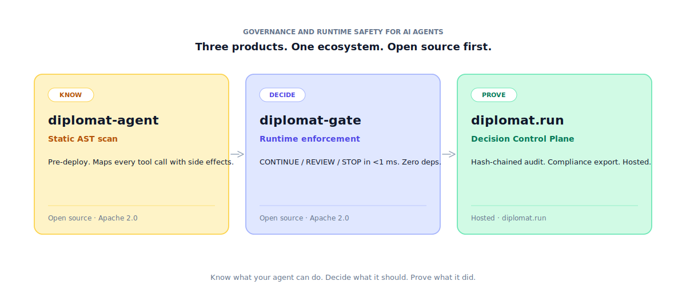
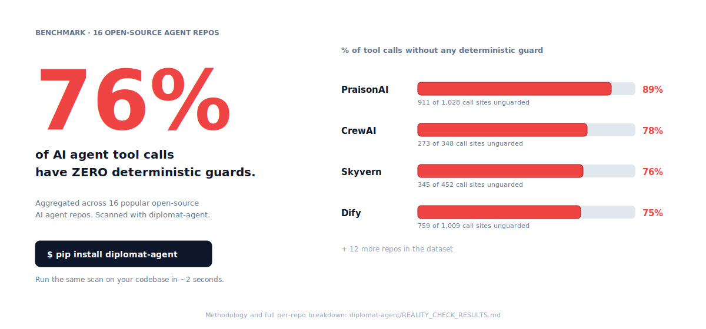

# Diplomat-ai

> **Governance and runtime safety for AI agents.**
>
> Three Apache 2.0 building blocks for teams shipping AI agents into production.
> Open source first. Deterministic. No LLM calls in the enforcement path.



---

## The problem

LLM-driven agents are now wired to APIs that send email, charge cards,
delete files, hit production databases, and call other agents. The agent
decides which function to invoke and with what arguments — most popular
frameworks treat hard enforcement as the operator's responsibility.

In practice, that means there is none.



We scanned **16 popular open-source AI agent codebases** with
`diplomat-agent`. **76% of tool calls with real-world side effects had
zero deterministic guards** — no input validation, no rate limit, no
auth check, no approval gate, no retry bound.

[Full per-repo results and methodology →](https://github.com/Diplomat-ai/diplomat-agent/blob/main/REALITY_CHECK_RESULTS.md)

---

## The three products

| | Stage | What it does | Status |
|---|---|---|---|
| [**diplomat-agent**](https://github.com/Diplomat-ai/diplomat-agent) | Know | Static AST scan. Maps every tool call with side effects. Pre-deploy. CI gate. | OSS · v0.4.0 · [PyPI](https://pypi.org/project/diplomat-agent/) |
| [**diplomat-gate**](https://github.com/Diplomat-ai/diplomat-gate) | Decide | Deterministic runtime enforcement. CONTINUE / REVIEW / STOP in <1 ms. Hash-chained audit. Zero deps. | OSS · v0.3.0 · [PyPI](https://pypi.org/project/diplomat-gate/) |
| [**diplomat.run**](https://diplomat.run) | Prove | Hosted Decision Control Plane. Cross-tenant immutable audit, real-time dashboard, managed approvals, EU AI Act Article 12 export. | Hosted · early access |

```bash
# Step 1 — find what your agent can do (static)
pip install diplomat-agent
diplomat-agent scan .

# Step 2 — gate what it should do at runtime (deterministic, <1 ms)
pip install "diplomat-gate[yaml]"
```

---

## What we are not

`diplomat-gate` is a **syntactic** enforcement layer, not a semantic one.
It is one layer in a defense-in-depth strategy, not a silver bullet.

- It does **not** classify intent or detect prompt injection — combine it
  with LLM-based guardrails when you need that.
- The hash-chained audit log resists accidental corruption — for strong
  tamper-evidence against a privileged local attacker, ship records to a
  write-once external store.
- Rate-limit policies are accurate single-process — for distributed
  workloads, wrap with an external lock or store.

We say this in every README, every pitch, and every conversation with a
prospect. Intentionally narrow. Compose with complementary tools.

---

## Standards alignment

OWASP Agentic Top 10 · EU AI Act Article 12 · NIST AI RMF · DORA ·
SARIF 2.1.0 · CSAF 2.0

---

## Get started

- **Try the scanner** — `pip install diplomat-agent && diplomat-agent scan .`
- **Run the OpenClaw demo** — clone [`diplomat-gate`](https://github.com/Diplomat-ai/diplomat-gate),
  run `python demos/openclaw/run.py`. ~60 seconds. No API key.
- **Reach out** — [josselin@diplomat.run](mailto:josselin@diplomat.run)
  · [diplomat.run](https://diplomat.run)

Diplomat-ai is built by [Diplomat Services SASU](https://diplomat.run),
Cagnes-sur-Mer, France. SIREN 100 251 834.
